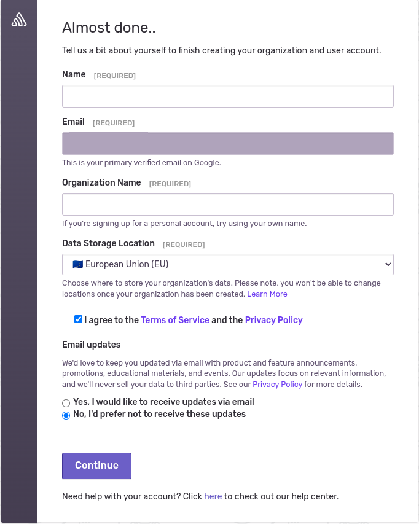
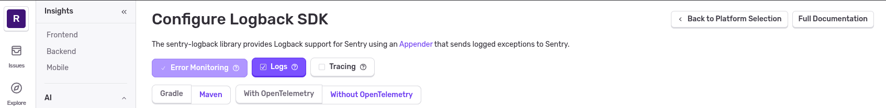
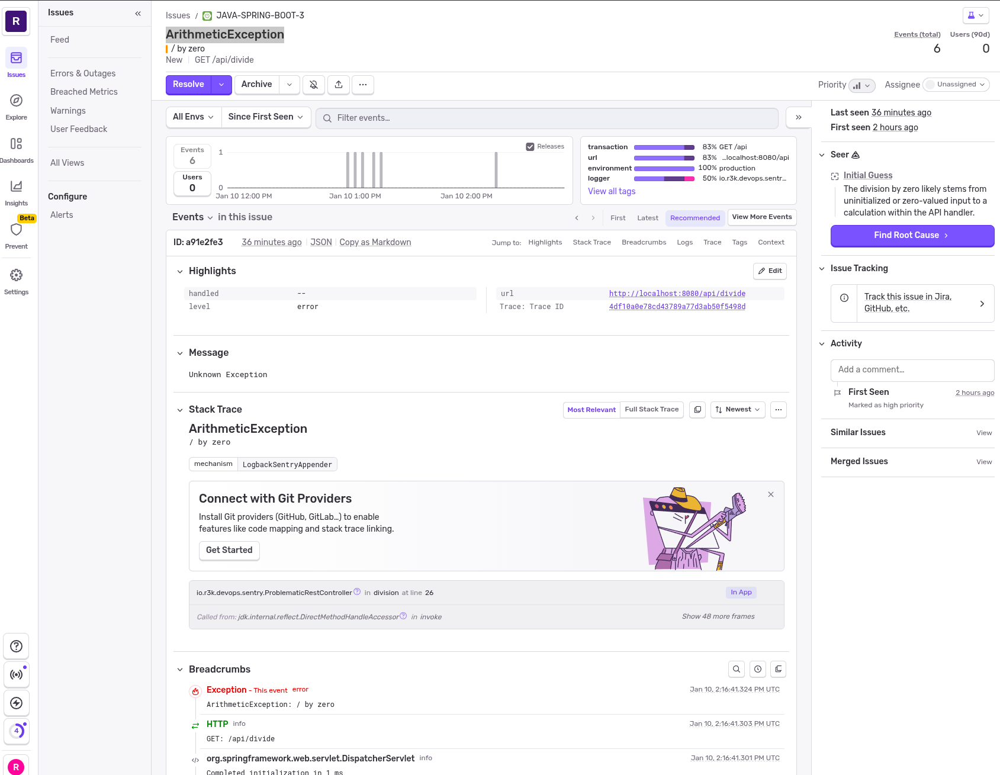
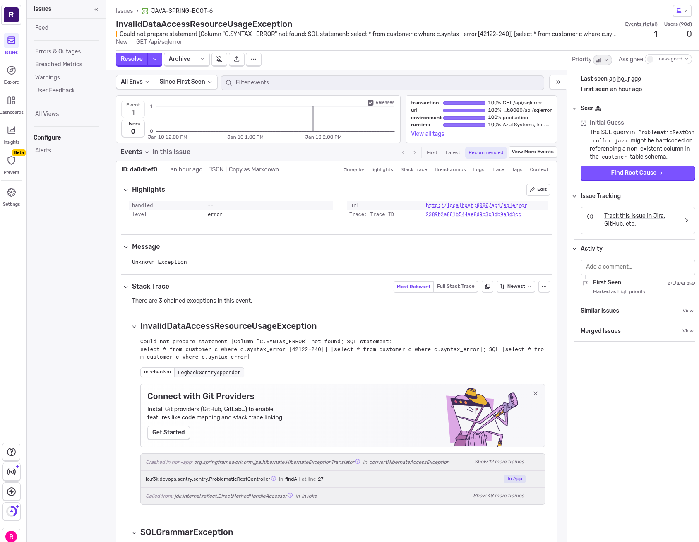

# Sentry Demo Application

This project is a simple Spring Boot application used to demonstrate error handling and monitoring in a minimal viable way.

Sentry already provides a wizard to setup your application, you can select Logback.

## Requirement

I assume you have Maven and Java 25 setup.

If not installed, you can always [mise](https://www.r3k.io/tech/tooling/)

```shell
mise use -g java@zulu-25.30.17.0
mise use -g maven
```

## Getting Started

Sign up for a [Sentry](https://sentry.io) demo account.



Look for the DSN value as it will be set in an environment variable `SENTRY_AUTH_TOKEN`.
It would look something like this:
```shell
https://1234999999.ingest.de.sentry.io/88888888888888
```



## Build and run the application.

```bash
mvn clean package

cat ./scripts/start-with-sentry.sh

export SENTRY_DSN=https://YOUR_PERSONAL_DSN

./scripts/start-with-sentry.sh
```

## Send issues to Sentry

### Divide by zero

You can simply click on this link which will cause a division by zero error:
http://localhost:8080/api/divide?by=0



### SQL error

You can simply click on this link which will cause a division by zero error:
http://localhost:8080/api/sqlerror


